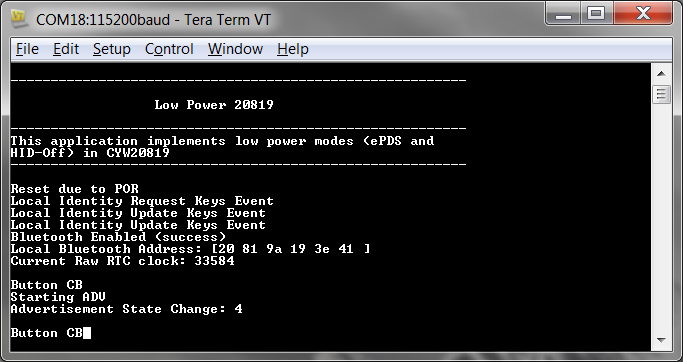

-------------------------------------------------------------------------------
## CYW208xx Low Power

This example demonstrates low power modes on CYW20819, CYW20820 and CYW89820 using ModusToolbox IDE.

### Requirements

[ModusToolbox™ IDE](https://www.cypress.com/products/modustoolbox-software-environment) v 2.0

Programming Language: C

Associated Parts: [CYW20819](https://www.cypress.com/datasheet/CYW20819), [CYW20820](https://www.cypress.com/datasheet/CYW20820)

### Supported Kits
* [CYW920819EVB-02 Evaluation Kit](http://www.cypress.com/CYW920819EVB-02)
* [CYW920820EVB-02 Evaluation kit](http://www.cypress.com/CYW920820EVB-02) 

Simply pick the supported kit in the IDE's New Application wizard. When you select a supported kit in the new application wizard the example is reconfigured automatically to work with the kit.

To work with a different supported kit, use the middleware selector to choose the BSP for the supported kit. You can also just start the process again and select a different kit.

If you want to use the application for a kit not listed here, you may need to update source files. If the kit does not have the required resources, the application may not work.

### Hardware Setup

*Boilerplate*

This example uses the kit’s default configuration. Refer to the kit guide to ensure the kit is configured correctly.

### Software Setup

This code example consists of two parts: a client and a server. For the client, download and install the CySmart app for [iOS](https://itunes.apple.com/us/app/cysmart/id928939093?mt=8) or [Android](https://play.google.com/store/apps/details?id=com.cypress.cysmart&hl=en). You can also use the [CySmart Host Emulation Tool](http://www.cypress.com/go/cysmart) Windows PC application if you have access to the [CY5677 CySmart BLE 4.2 USB Dongle](http://www.cypress.com/documentation/development-kitsboards/cy5677-cysmart-bluetooth-low-energy-ble-42-usb-dongle).

Scan the following QR codes from your mobile phone to download the CySmart app.

This example uses a terminal emulator. Install one if you don't have one. The instructions use [Tera Term](https://ttssh2.osdn.jp/index.html.en).

This example requires no additional software or tools.

### Using the Code Example

If you are unfamiliar with this process, see [KBA225201](https://community.cypress.com/docs/DOC-15968) for all the details.

#### In the ModusToolbox IDE

1. Click the **New Application** link in the Quick Panel (or, use **File > New > ModusToolbox IDE Application**).
2. Pick your kit. You must use a kit or device supported by the code example.  Some application settings (e.g. which pin controls an LED) may be adjusted automatically based on the kit you select.
3. In the **Starter Application** window, choose the example.
4. Click **Next** and complete the application creation process.

 If you are unfamiliar with this process, see [KBA225201](https://community.cypress.com/docs/DOC-15968) for all the details.

#### In Command Line Tools

Ensure that the development environment is set up correctly. See KBAnnnnn for details.

1. Download and unzip this repository onto your local machine, or clone the repository.
2. Open the Cygwin terminal and navigate to the application folder.
3. Import required libraries by executing the command **make -f getlibs.mk**.

### Operation

1. Connect the kit to your PC using the provided USB cable through the USB connector.

2. If you want to measure power consumption, connect an ammeter across J15.1 and J15.2, and a second ammeter across J8.2 and J8.4 to measure current in VDDIO and VBAT domains respectively as shown in Figure 1. If you don’t have 2 ammeters, then measure current on one domain at a time. Note that the VPA_BT power domain is not used on this kit and hence there is no need to measure current on this domain.

Figure 1. CYW920819EVB-02 Jumpers to measure Current

3. Remove jumpers J14 and J18 to disable unused peripherals on the evaluation kit.

4. The USB Serial interface on the kit provides access to the two UART interfaces of the CYW20819 device – WICED HCI UART, and WICED Peripheral UART (PUART). The HCI UART is used only for downloading the application code in this code example and the PUART is used for printing the Bluetooth stack and application trace messages. Open your terminal software and select the PUART COM port, with a baud rate setting of 115200 bps. If you want to disable the trace messages, then comment out the following line in low_power_208xx.c:
*wiced_set_debug_uart( WICED_ROUTE_DEBUG_TO_PUART );*

5. Program the board.

   ##### Using ModusToolbox IDE *(Subject to change)*

   1. Select the application project in the Project Exporer
   2. In the **Quick Panel**, scroll down, and click **\<App Name\> Build and Program**.

   ##### Using CLI

   1. From the Cygwin terminal, execute the command **make build** to build the program for the defalut target. You can specify a tool chain as well (e.g. **make TOOLCHAIN=GCC_ARM** .)
   2. Execute command **make qprogram** to program the built application to the board.

**Note**: If the download fails, it is possible that a previously loaded application is preventing programming. For example, the application may use a custom baud rate that the download process does not detect or the device may be in low-power mode. In that case, it may be necessary to put the board in recovery mode, and then try the programming operation again from the IDE. To enter recovery mode, first, press and hold the Recover button (SW1), press and release the Reset button (SW2), and then release the Recover button (SW1).

6. After the programming is complete, the device will boot up and enter ePDS mode. Give the device a few seconds (~5) to enter ePDS mode. Note the current readings from ammeters. These are the current consumed in ePDS mode with no Bluetooth activity.

Figure 2. Bootup Log

7. Press switch SW3 on the evaluation kit. The application will get a button callback and it will start advertising. Note the current readings on the ammeters. This is the average current in ePDS mode with advertisement.

Figure 3. Start Advertisement Log

8. Do the following to test a connection using the CySmart mobile app:
    1. Turn ON Bluetooth on your Android or iOS device.
    2. Launch the CySmart app.
    3. Swipe down on the CySmart app home screen to start scanning for BLE Peripherals; your device appears in the CySmart app home screen. Select your device to establish a BLE connection. Once the device is connected, you can read the current numbers from the ammeters. These are the current in ePDS mode with a connection at a connection interval of 100 ms.
    4. Select the GATT DB from the carousel view.
    5. Select Battery Service and then select Characteristics.
    6. Select Notify. CYW920819EVB-02 will start sending GATT notifications to the mobile device. Note the current readings on the ammeters. These are the current in ePDS mode with a connection at a connection interval of 100 ms and notifications being sent every 5 seconds.
    7. Disconnect the Bluetooth connection by pressing SW3 on the kit or by backing out from the mobile app. The device will enter HID-Off mode for 10 seconds. Note the current numbers. These are the current numbers in HID-Off mode.

Figure 4. Connection, Pairing, and Connection Parameters Update Messages

Figure 5. Disconnection, HID-Off, and Restart Trace Messages

9. Do the following to test using the CySmart desktop application on a PC:
    1. Open the CySmart desktop application and connect to the CySmart CY5677 dongle (Central device). Refer to the CySmart User Guide on how to use this application.
    2. Scan and Connect to 'low_power_208xx' device. When asked for a connection parameter update, accept it. After the connection is established, you can measure the current values. These are the current numbers in ePDS mode with connection at 100 ms interval.
    3. Go to the device tab and click Discover all attributes.
    4. Click on Enable all Notifications. The device will start sending notifications every 5 seconds. Note the current readings on the ammeters. These are the current in ePDS mode with a connection at a connection interval of 100 ms and notifications being sent every 5 seconds.
    5. Click Disconnect to disconnect from the Central device. The device will enter HID-Off mode for 10 seconds. Note the current numbers. These are the current numbers in HID-Off mode.

### Design and Implementation

This code example implements a GATT Server and GAP Peripheral role on CYW920819EVB-02. Once the device is powered on, it boots up, configures sleep, initializes the Bluetooth stack, registers a button interrupt and GATT database, and then enters ePDS mode.
You need to press switch SW3 on the kit to start low-duty advertisement. The device is still in ePDS mode. You can now connect to the device using a GAP Central device. Upon connection, the device will request connection parameters to be updated (specifically, the connection interval to 100 ms). If the request is accepted, the connection interval changes to 100 ms. The device remains in ePDS mode and maintains the connection by sending empty packets. The GAP Central device can now discover all attributes and enable GATT notifications. The peripheral will start sending a dummy battery level value every 5 seconds.
The GATT Server implements a Battery Service with a Battery Level characteristic. This characteristic is readable and notifiable.
The application code and the Bluetooth stack runs on the Arm® Cortex®-M4 core of the CYW20819 SoC. The application-level source files for this code example are listed in Table 1.

Table 1. Code Example File Structure
|**File Name**|**Comments**|
|-------------|------------|
|low_power_20819.c|Contains the application_start() function, which is the entry point for execution of the user application code after device startup. It also has the sleep callback function used by the PMU. The contents in this file can be referenced to implement low-power modes in other applications.|
|app_bt_cfg.c, app_bt_cfg.h|These files contain the runtime Bluetooth stack configuration parameters such as device name and advertisement/connection settings.|
|cycfg_bt.h, cycfg_gatt_db.c, cycfg_gatt_db.h|These files reside in the GeneratedSource folder under the application folder. They contain the GATT database information generated using the Bluetooth Configurator tool.|
|low_power_20819_ble.c|This file contains the Bluetooth events callback function along with other functions to service Bluetooth events. It also contains the button callback function.|

###Application Flow

The following diagrams show the flow of the application code.
    	Figure 6 shows the flow of the application when it boots up.
    	Figure 7 shows the flow of the button callback.
    	Figure 8 shows the flow of BT stack management event callbacks.
    	Figure 9 shows the flow of GATT event callbacks.
    	Figure 10 shows the tree of the functions that are called on the BT and GATT event callbacks from the stack.

Figure 6. Application Flow After Bootup

Figure 7. Button Callback Flow

Figure 8. BT Stack Management Callback Flow

Figure 9. GATT Event Callback Flow

Figure 10. BT Management and GATT Events Function Call Tree

###Current Measurements

The instantaneous current consumed by the device is not a steady-state value, but varies depending on the state of the chip that dynamically changes with power mode transitions, making it practically impossible to measure each individual instantaneous current with a handheld multimeter because the duration of these current bursts is very small.
Therefore, you should use a multimeter that provides the option to set the ”aperture” of the measurement. The aperture is the period ”T” during which the multimeter measures the instantaneous currents, integrates them, and then displays the average current for the period ”T”. For accurate measurements, the aperture of the multimeter should be set to be the same as the advertising or the connection interval. The following tables gives the current values for VBAT and VDDIO in various scenarios. Note that the current is averaged over 10 second intervals.

Table 2. CYW20819 Current in Different Modes

| State                                   | ePDS Enabled VDDIO | ePDS Enabled VBAT | ePDS Disabled VDDIO | ePDS Disabled VBAT |
|-----------------------------------------|--------------------|-------------------|---------------------|--------------------|
| No Bluetooth activity                   | 2.1 uA             | 7.7 uA            | 47.9 uA             | 0.97 mA            |
| ADV (2.56 seconds interval)             | 2.3 uA             | 26.1 uA           | 47.9 uA             | 0.98 uA            |
| Connection (100 ms connection interval) | 3.2 uA             | 147.2 uA          | 47.9 uA             | 1.02 mA            |
| Notifications (5 s interval)            | 3.3 uA             | 148.3 uA          | 47.9 uA             | 1.02 mA            |

Table 3. CYW20819 Current in HID-Off Mode

| State   | VDDIO  | VBAT   |
|---------|--------|--------|
| HID-Off | 2.2 uA | 0.7 uA |

Table 4. CYW20819 Current in Different Connection Intervals

| Connection Interval | ePDS Enabled VDDIO | ePDS Enabled VBAT | ePDS Disabled VDDIO | ePDS Disabled VBAT |
|---------------------|--------------------|-------------------|---------------------|--------------------|
| 7.5 ms | 14.5 uA | 1.49 mA | 47.9 uA | 1.58 mA |
| 10 ms | 11.3 uA | 1.16 mA | 47.9 uA | 1.43 mA |
| 11.25 ms | 10.2 uA | 1.03 mA | 47.9 uA | 1.38 mA |
| 12.5 ms | 9.4 uA | 0.89 mA | 47.9 uA | 1.34 mA |
| 13.75 ms | 9.9 uA | 0.96 mA | 47.9 uA | 1.31 mA |
| 15 ms | 9.4 uA | 0.89 mA | 47.9 uA | 1.28 mA |
| 25 ms | 6.6 uA | 0.54 mA | 47.9 uA | 1.17 mA |
| 50 | 4.4 uA | 0.27 mA | 47.9 uA | 1.08 mA |
| 100 | 3.2 uA | 0.14 mA | 47.9 uA | 1.03 mA |
| 500 | 2.31 uA | 0.04 mA | 47.9 uA | 0.98 mA |
| 1000 ms | 2.2 uA | 0.02 mA | 47.9 uA | 0.98 |
| 2000 ms | 2.2 uA | 0.02 mA | 47.9 uA | 0.98 mA |
| 4000 ms | 2.1 uA | 0.02 mA | 47.9 uA | 0.97 mA |

Table 5. CYW20820 Current in Different Modes

| State                                   | ePDS Enabled VDDIO | ePDS Enabled VBAT | ePDS Disabled VDDIO | ePDS Disabled VBAT |
|-----------------------------------------|--------------------|-------------------|---------------------|--------------------|
| No Bluetooth activity                   | 2.45 uA             | 6.21 uA            | 48.62 uA             | 0.98 mA            |
| ADV (2.56 seconds interval)             | 2.65 uA             | 20.65 uA           | 45.08 uA             | 0.99 uA            |
| Connection (100 ms connection interval) | 3.89 uA             | 137.8 uA          | 45.11 uA             | 1.02 mA            |
| Notifications (5 s interval)            | 4.15 uA             | 142.54 uA          | 45.23 uA             | 1.02 mA            |

Table 6. CYW20819 Current in HID-Off Mode

| State   | VDDIO  | VBAT   |
|---------|--------|--------|
| HID-Off | 2.2 uA | 0.7 uA |

Table 7. CYW20820 Current in Different Connection Intervals

| Connection Interval | ePDS Enabled VDDIO | ePDS Enabled VBAT | ePDS Disabled VDDIO | ePDS Disabled VBAT |
|---------------------|--------------------|-------------------|---------------------|--------------------|
| 7.5 ms | 21.31 uA | 1.71 mA | 45.22 uA | 1.56 mA |
| 10 ms | 16.5 uA | 1.3 mA | 45.23 uA | 1.42 mA |
| 11.25 ms | 14.95 uA | 1.16 mA | 45.23 uA | 1.37 mA |
| 12.5 ms | 13.69 uA | 1.05 mA | 45.2 uA | 1.37 mA |
| 13.75 ms | 11.88 uA | 0.92 mA | 45.19 uA | 1.29 mA |
| 15 ms | 11.23 uA | 0.85 mA | 45.19 uA | 1.27 mA |
| 25 ms | 7.89 uA | 0.51 mA | 445.2 uA | 1.15 mA |
| 50 | 5.28 uA | 0.26 mA | 45.19 uA | 1.07 mA |
| 100 | 3.93 uA | 0.13 mA | 45.14 uA | 1.02 mA |
| 500 | 2.8 uA | 0.035 mA | 45.21 uA | 0.99 mA |
| 1000 ms | 2.63 uA | 0.021 mA | 45.18 uA | 0.98 |
| 2000 ms | 2.61 uA | 0.017 mA | 45.16 uA | 0.98 mA |
| 4000 ms | 2.56 uA | 0.011 mA | 45.07 uA | 0.98 mA |

Note that these current values also include some leakage current on the board because some GPIOs connected to the on-board components draw current. For accurate current numbers, see the device datasheet.

####Resources and Settings
This example uses the default device configurator settings i.e., when this example is imported to ModusToolbox, the IDE creates the file design.modus file that is used for design configuration with default settings for the kit. Note that in the design.modus file, the SPI and I2C modules are enabled, but because these are not used in the application, they will not cause any current leakage. It also provides the GATT database files so you don’t have to generate the files.

###Reusing This Example
This example is designed in a way so that you can use the low-power functions from this example in your own example with minimal changes.

### Related Resources

| Application Notes |  |
|------------------------------------------------------------------------------|---------------------------------------------------------------------------------------------|
| [AN225684 ](http://www.cypress.com/an225684) – Getting Started with CYW208xx | Describes the CYW208xx device and demonstrates how to build your first ModusToolbox project |

| Code Examples |
|--------------------------------------------------------------------------------------------------------------------------------------------|
| Visit the [Cypress GitHub](https://www.cypress.com/mtb-github) repo for a comprehensive collection of code examples using ModusToolbox IDE |

| Development Kit Documentation |
|--------------------------------------------------------------------------------------------------------------------------------------------|
| [CYW20819EVB-02 Evaluation Kit](http://www.cypress.com/CYW920819EVB-02) |

| Tools Documentation |  |
|------------------------------------------------------------------------------|---------------------------------------------------------------------------------------------|
| [ModusToolbox IDE](http://www.cypress.com/modustoolbox)| The ModusToolbox cross-platform IDE simplifies development for IoT designers. Look in <ModusToolbox install>/docs.|

#### Other Resources

Cypress provides a wealth of data at www.cypress.com to help you to select the right device, and quickly and effectively integrate the device into your design.

### Document History

Document Title: CE225540 - CYW208xx Low Power

| Revision | Submission Date | Description of Change |
| -------- | --------------- | --------------------- |
| **       |   09/16/2019    | New code example      |

All other trademarks or registered trademarks referenced herein are the property of their respective
owners.

© Cypress Semiconductor Corporation, 2019. This document is the property of Cypress Semiconductor Corporation and its subsidiaries (“Cypress”).  This document, including any software or firmware included or referenced in this document (“Software”), is owned by Cypress under the intellectual property laws and treaties of the United States and other countries worldwide.  Cypress reserves all rights under such laws and treaties and does not, except as specifically stated in this paragraph, grant any license under its patents, copyrights, trademarks, or other intellectual property rights.  If the Software is not accompanied by a license agreement and you do not otherwise have a written agreement with Cypress governing the use of the Software, then Cypress hereby grants you a personal, non-exclusive, nontransferable license (without the right to sublicense) (1) under its copyright rights in the Software (a) for Software provided in source code form, to modify and reproduce the Software solely for use with Cypress hardware products, only internally within your organization, and (b) to distribute the Software in binary code form externally to end users (either directly or indirectly through resellers and distributors), solely for use on Cypress hardware product units, and (2) under those claims of Cypress’s patents that are infringed by the Software (as provided by Cypress, unmodified) to make, use, distribute, and import the Software solely for use with Cypress hardware products.  Any other use, reproduction, modification, translation, or compilation of the Software is prohibited.
TO THE EXTENT PERMITTED BY APPLICABLE LAW, CYPRESS MAKES NO WARRANTY OF ANY KIND, EXPRESS OR IMPLIED, WITH REGARD TO THIS DOCUMENT OR ANY SOFTWARE OR ACCOMPANYING HARDWARE, INCLUDING, BUT NOT LIMITED TO, THE IMPLIED WARRANTIES OF MERCHANTABILITY AND FITNESS FOR A PARTICULAR PURPOSE.  No computing device can be absolutely secure.  Therefore, despite security measures implemented in Cypress hardware or software products, Cypress shall have no liability arising out of any security breach, such as unauthorized access to or use of a Cypress product.  CYPRESS DOES NOT REPRESENT, WARRANT, OR GUARANTEE THAT CYPRESS PRODUCTS, OR SYSTEMS CREATED USING CYPRESS PRODUCTS, WILL BE FREE FROM CORRUPTION, ATTACK, VIRUSES, INTERFERENCE, HACKING, DATA LOSS OR THEFT, OR OTHER SECURITY INTRUSION (collectively, “Security Breach”).  Cypress disclaims any liability relating to any Security Breach, and you shall and hereby do release Cypress from any claim, damage, or other liability arising from any Security Breach.  In addition, the products described in these materials may contain design defects or errors known as errata which may cause the product to deviate from published specifications.  To the extent permitted by applicable law, Cypress reserves the right to make changes to this document without further notice. Cypress does not assume any liability arising out of the application or use of any product or circuit described in this document.  Any information provided in this document, including any sample design information or programming code, is provided only for reference purposes.  It is the responsibility of the user of this document to properly design, program, and test the functionality and safety of any application made of this information and any resulting product.  “High-Risk Device” means any device or system whose failure could cause personal injury, death, or property damage.  Examples of High-Risk Devices are weapons, nuclear installations, surgical implants, and other medical devices.  “Critical Component” means any component of a High-Risk Device whose failure to perform can be reasonably expected to cause, directly or indirectly, the failure of the High-Risk Device, or to affect its safety or effectiveness.  Cypress is not liable, in whole or in part, and you shall and hereby do release Cypress from any claim, damage, or other liability arising from any use of a Cypress product as a Critical Component in a High-Risk Device.  You shall indemnify and hold Cypress, its directors, officers, employees, agents, affiliates, distributors, and assigns harmless from and against all claims, costs, damages, and expenses, arising out of any claim, including claims for product liability, personal injury or death, or property damage arising from any use of a Cypress product as a Critical Component in a High-Risk Device.  Cypress products are not intended or authorized for use as a Critical Component in any High-Risk Device except to the limited extent that (i) Cypress’s published data sheet for the product explicitly states Cypress has qualified the product for use in a specific High-Risk Device, or (ii) Cypress has given you advance written authorization to use the product as a Critical Component in the specific High-Risk Device and you have signed a separate indemnification agreement.
Cypress, the Cypress logo, Spansion, the Spansion logo, and combinations thereof, WICED, PSoC, CapSense, EZ-USB, F-RAM, and Traveo are trademarks or registered trademarks of Cypress in the United States and other countries.  For a more complete list of Cypress trademarks, visit cypress.com.  Other names and brands may be claimed as property of their respective owners.
